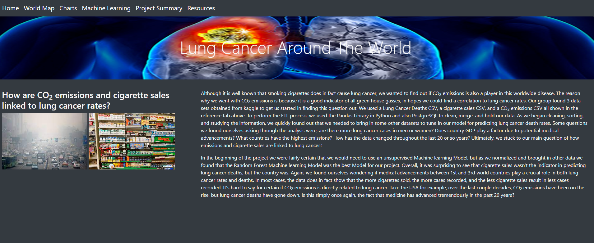
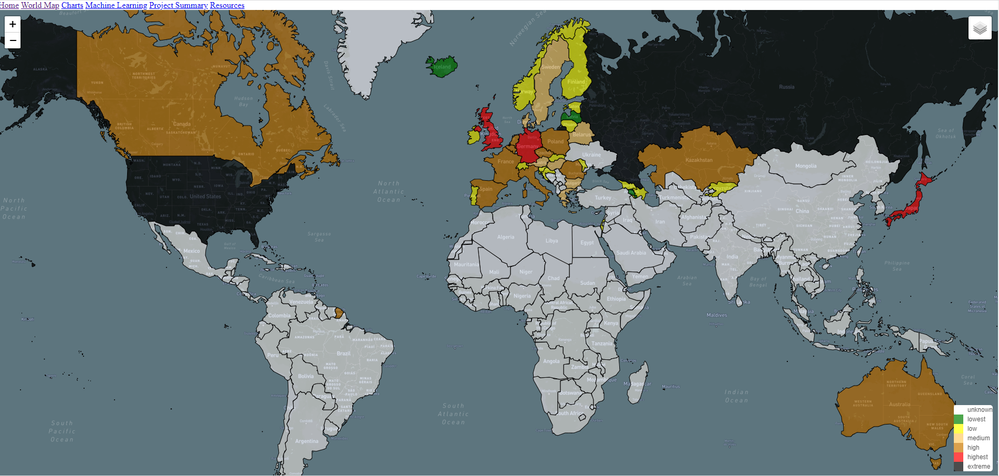
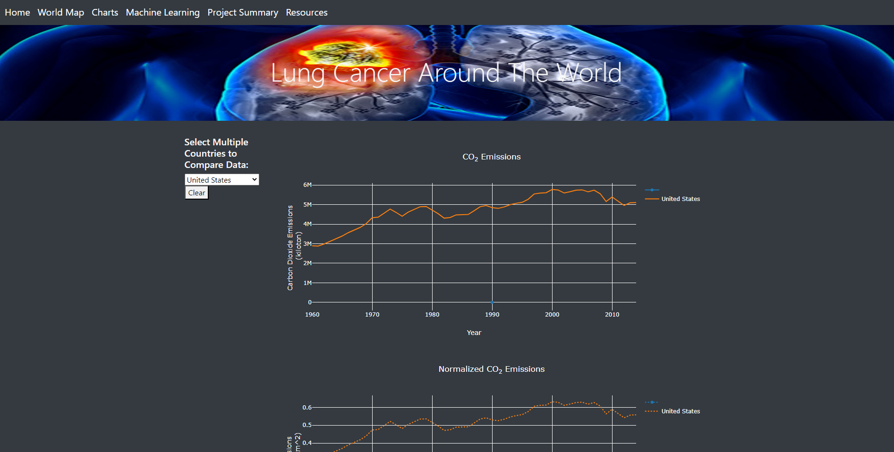
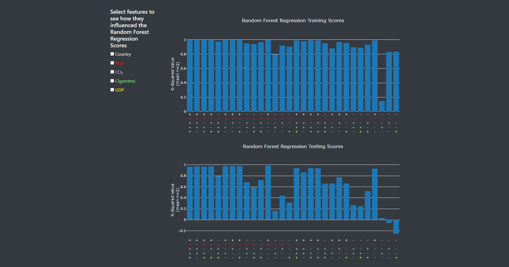
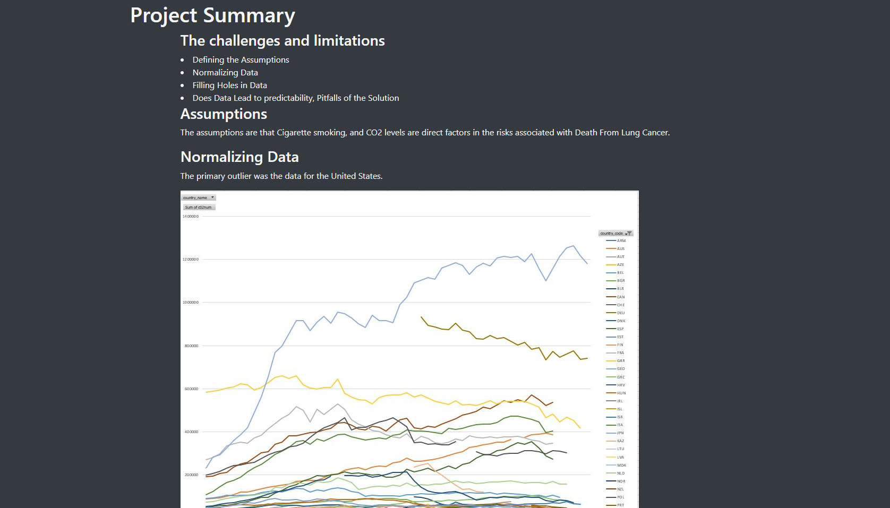
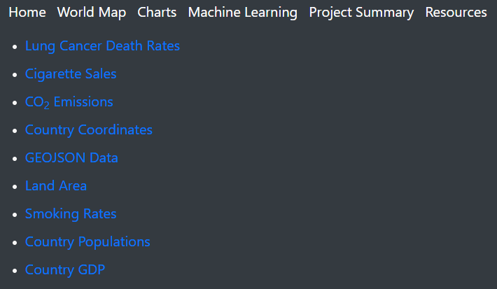

# Lung Cancer Around the World

## Overview of Analysis ##
Although it is well known that smoking cigarettes does in fact cause lung cancer, we wanted to find out if CO2 emissions is also a player in this
worldwide disease. So our question we wanted to base our analysis from, is how are cigarette sales and emission linked to lung cancer. This analysis is based on 3 datasets obtained from kaggle. The [Lung Cancer deaths CSV](https://www.kaggle.com/datasets/programmerrdai/cancer?select=lung-cancer-deaths-per-100000-by-sex-1950-2002.csv) contained 4,572 rows of information on country, year, death rates per 100,000 for females, and death rates per 100,000 for males. The [cigarette sales CSV](https://www.kaggle.com/datasets/programmerrdai/cancer?select=sales-of-cigarettes-per-adult-per-day.csv) contained 2,767 rows of data including country, country code, year, and sales of cigarettes per day per adult average for the year. The [CO2 emissions CSV](https://www.kaggle.com/datasets/ulrikthygepedersen/co2-emissions-by-country) contains 13,953 rows on country code, country name, year, and CO2 value. We have pulled in other supporting datasets such as country coordinates, GDP, population, and smoking rates but the analysis is still based off these 3 datasets.  

### Purpose of Analysis ###
The purpose of the analysis is to determine if cigarette sales and CO2 emissions are linked to lung cancer.  

## ETL Process ##
The data was combined into a PostgreSQL database. We used both the Pandas Library in Python and PostgreSQL to clean, sort, and merge our data to a state where we could use it for our visualizations and Machine Learning Models. Since the datasets we were using had a primary key "Country", it was fairly easy to get the data merged together. 

### Transitioning the Data to Javascript
In order to make working with the data in Javascript easier, the pandas DataFrames were converted to JSON files using the Python json library and the json.dumps method. 

### Creating a GEOJSON File for Map
In order to incorporate our data into the world map, a GEOJSON file with country borders was obtained [here](https://geojson-maps.ash.ms/). Next, the complete list of countries in the GEOJSON file were obtained, and used to modify our Pandas DataFrame to be of matching length and include all countries. Lastly, the features of interest were selected from the DataFrame and GEOJSON file, and both files were looped through simultaneously with for loops to build a new GEOJSON file with all desired content

## Dashboard
We created a [webpage](https://mzabrisk.github.io/final_project_group6/dashboard/index.html) to portray our findings through visualizations using the mapbox API and the Plotly library. The webpage has several different tabs, including:

* A home page, which provides the background for our project
* A world map utilizing the mapbox API showing various data for each country, including:

  * total CO2 emissions
  * normalized CO2 emissions
  * lung cancer death rates (total, male, and female)
  * cigarette sales
  * population

* A tab containing customizable charts 
* A machine learning tab describing the creation and results of our model
* A summary tab summarizing our overall project outcome
* A resources page with links to all of the data and resources used

## Machine Learning
We started with an unsupervised model using the K-means method and clustering. According to our elbow curve, we decided there should be 4 clusters as shown below. Our initial attempt at clustering led to a very obvious cluster containing all of the United States data. Upon further inspection, it was obvious that our CO2 data needed to be normalized, for which we used [country land area](https://data.worldbank.org/indicator/AG.LND.TOTL.K2?end=2020&start=2020&view=map). 

Upon closer evaluation, we decided that we want to look into incorporating a supervised model, using lung cancer death rates as the outcome. We started out using a linear regression model, but quickly progressed to a Random Forest Regression Model. Here, we found that the country appeared to be the most important feature in the analysis. It was the only variable that provided an accuracy score of above 90% for the training data when it was the solitary independent variable. With each variation of feature selection, the only time the training score was above 90% is when the country was included. It seems that lung cancer and CO2 levels are not as closely related to lung cancer deaths as country. In future research, it would be of value to include cancer diagnoses to ascertain the real relationship between the independent variables and  cancer rates versus cancer deaths. 

## Challenges
* Finding a Machine Learning model that is right for our data that we can incorporate into our webpage.
* Getting the right data that helps our overall goal of determining if cigarette sales and CO2 emissions are linked to lung cancer. 
## Successes
* Working as a team and making great progress even though we are all on different schedules. 
* Completing our work on time and holding eachother accountable for getting the project completed.
* Creating a good looking webpage that is interactive to portrey our findings.
## Results
This far along in our project it is clear that cigarette sales are linked to lung cancer. Over the last 20 years or so, cigarette sales have gone down, but so has lung cancer deaths. According to our Machine Learning Model, the feature that predicts lung cancer the best is based on the country. We are thinking this has to do with the fact that first world countries have access to better advancements in medicine, while third world countries don't have that privilage. It is a little harder to tell if CO2 emissions have a direct correlation to lung cancer rates, but that is one of the things we wanted to find out so it was worth looking into. 
## Summary
All in all, some things that have popped out to us so far is that CO2 emissions are continuing to rise in most cases. Especially in more developed countries. Another thing that stood out was the fact that cigarette sales have been going down in most countries, and along with that, the lung cancer rates have been going down as well. Could this be a direct link to cigarettes, or is it simply an advancement in medicine?
