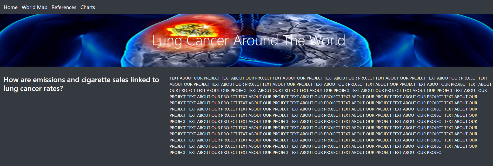
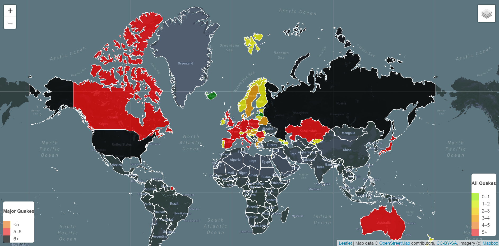
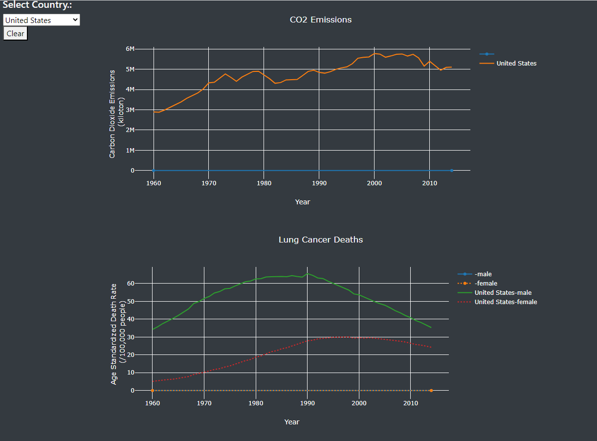
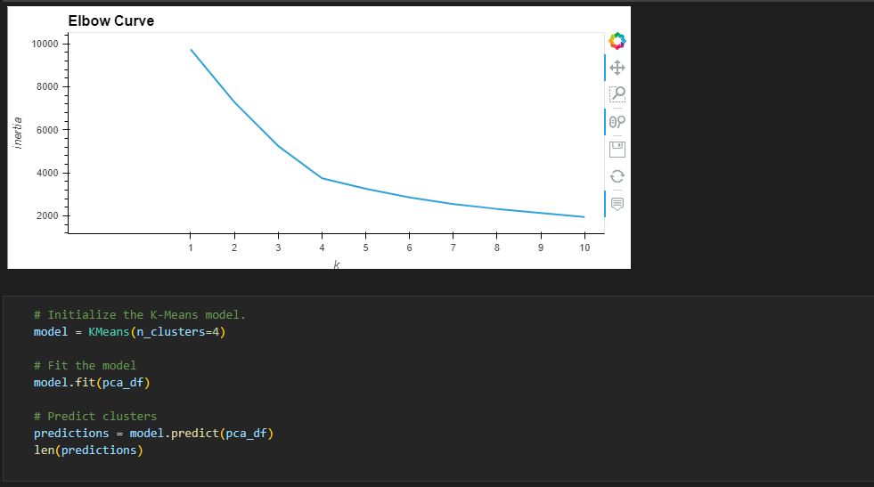
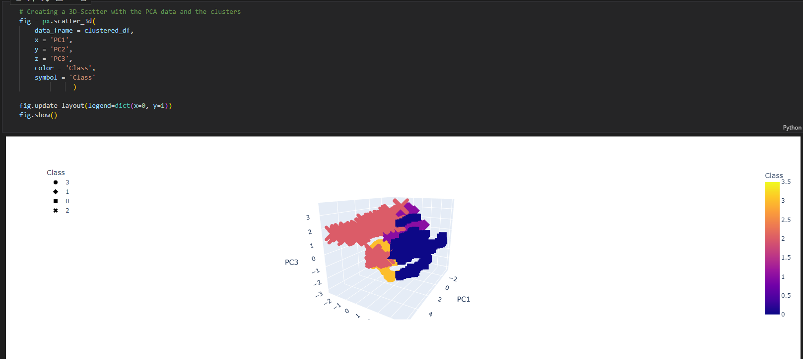

# Lung Cancer, C02 Emissions, and Country #

## Overview of Analysis ##
This analysis is based on 4 datasets obtained from kaggle. The [Lung Cancer deaths CSV](https://www.kaggle.com/datasets/programmerrdai/cancer?select=lung-cancer-deaths-per-100000-by-sex-1950-2002.csv) contained 4,572 rows of information on country, year, death rates per 100,000 for females, and death rates per 100,000 for males. The [cigarette sales CSV](https://www.kaggle.com/datasets/programmerrdai/cancer?select=sales-of-cigarettes-per-adult-per-day.csv) contained 2,767 rows of data including country, country code, year, and sales of ciegarettes per day per adult average for the year. The [CO2 emissions CSV](https://www.kaggle.com/datasets/ulrikthygepedersen/co2-emissions-by-country) contains 13,953 rows on country code, country name, year, and CO2 value. We have pulled in other supporting datasets such as country coordinates, GDP, population, and smoking rates but the analysis is still based off these 4 datasets. 

### Purpose of Analysis ###
The purpose of the analysis is to determine if cigarette sales and CO2 emissions are linked to lung cancer.  

## ETL Process ##
The data was combined into a database. We used both the Pandas Library in Python and PostgreSQL to clean, sort, and merge our data to a state where we could use it for our visualizations and Machine Learning Models.

## Dashboard
We created a webpage to portray our findings through visualizations and using the mapbox API. The webpage has several different tabs, including:

- A home page, which provides the background for our project
- A world map utilizing the mapbox API showing various data for each country, including:
        - total CO2 emissions
        - normalized CO2 emissions
        - lung cancer death rates (total, male, and female)
        - cigarette sales
        - population

- A tab containing customizable charts 
- A machine learning tab describing the creation and results of our model
- A summary tab summarizing our overall project outcome
- A references page with links to all of the data and resources used

.
.
.

## Machine Learning
We started with a unsupervised model using the K-means method and clustering. According to our elbow curve, we decided there should be 4 clusters as shown below. Our initial attempt at clusting led to a very obvious cluster containing all of the United States data. Upon further inspection, it was obvious that our CO2 data needed to be normalized, for which we used [country land area](https://data.worldbank.org/indicator/AG.LND.TOTL.K2?end=2020&start=2020&view=map). 

.
.

Upon closer evaluation, we decided that we want to look into incorporating a supervised model, using lung cancer death rates as the outcome. We started out using a linear regressin model, but quickly progressed to a Random Forrest Regression Model. Here we found SUMMARY TEXT FOR RANDOM FOREST REGRESSOR.

## Challenges
* Finding a Machine Learning model that is right for our data that we can incorporate into our webpage.
* Getting the right data that helps our overall goal of determining if cigarette sales and CO2 emissions are linked to lung cancer. 
## Successes
* Working as a team and making great progress even though we are all on different schedules. 
## Results
This far along in our project it is clear that cigarette sales are linked to lung cancer. Over the last 20 years or so, cigarette sales have gone down, but so has lung cancer deaths. It is a little harder to tell if CO2 emissions have a direct correlation to lung cancer rates, but that is one of the things we wanted to find out so it was worth looking into. 
## Summary
All in all, some things that have popped out to us so far is that CO2 emissions are continuing to rise in most cases. Especially in more developed countries. Another thing that stood out was the fact that cigarette sales have been going down in most countries, and along with that the lung cancer rates have been going down as well. Could this be a direct link to cigarettes, or is it simply an advancment in medicine?
